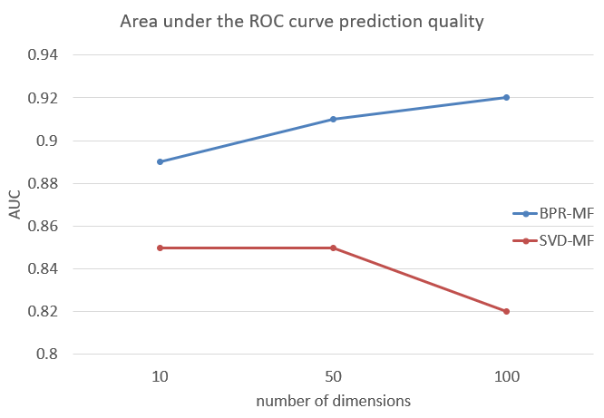

# Bayesian Personalized Ranking Neural Network
Pytorch implementation of Bayesian Personalized Ranking from implicit feedback for top-N item recommendation.

### Original Paper
- Bayesian Personalized Ranking from Implicit Feedback (2009), S Rendle, C Freudenthaler, Z Gantner.
  [[pdf]](https://arxiv.org/ftp/arxiv/papers/1205/1205.2618.pdf)

### Dataset
- Benchmark MovieLens 1M Dataset (https://grouplens.org/datasets/movielens/)

### Result
Implemented BPR-MF and compared it with SVD-MF. The proposed BPR-MF for the AUC score showed better performance as shown in the results.

    

## Author
Sein Jang
